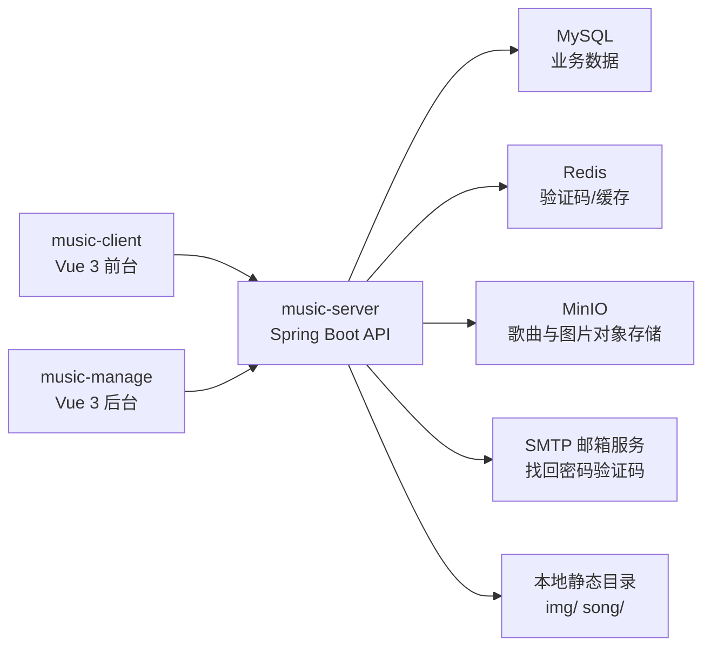
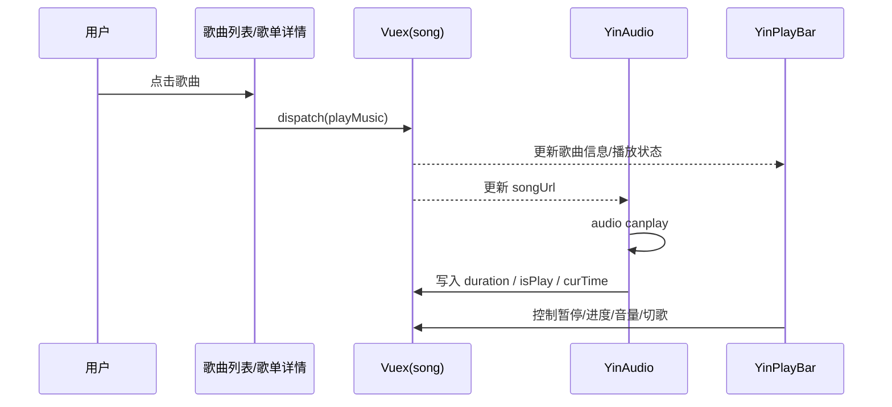
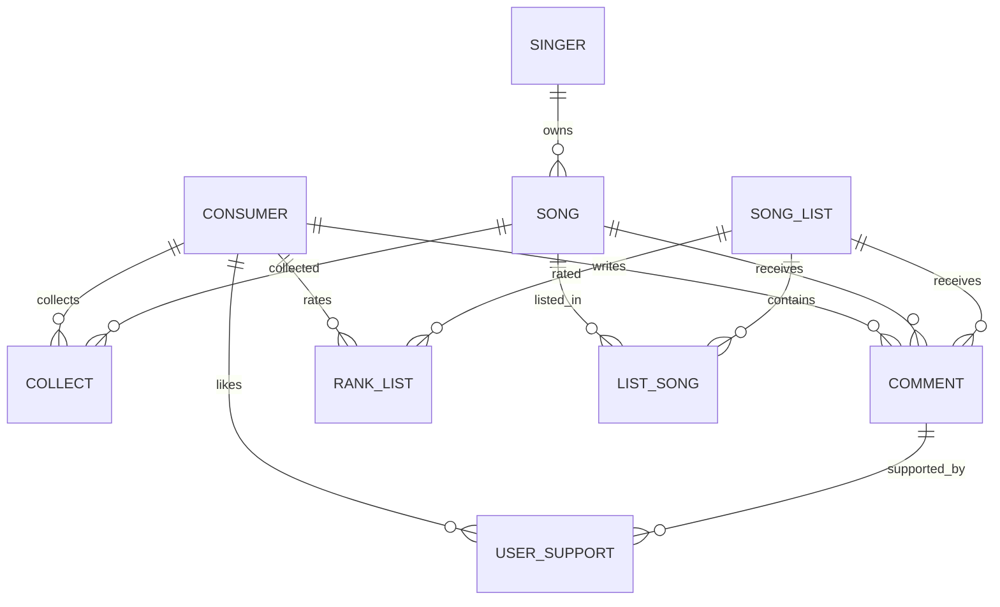

# music-website 项目架构解析

## 1. 文档目的

这份文档基于当前仓库源码进行静态分析，目标是把项目的：

- 仓库结构
- 三端职责边界
- 核心运行链路
- 数据模型与接口分层
- 外部依赖与部署方式
- 现有架构优点、风险和优化方向

梳理成一份可维护、可交接、可扩展的技术说明。

说明：

- 分析范围覆盖根仓库下 `music-client`、`music-manage`、`music-server` 三个子项目。
- 结论主要来自源码与配置文件，不包含本地实际启动后的运行态验证。

---

## 2. 项目总览

### 2.1 仓库定位

这是一个典型的“三段式音乐网站”项目：

- `music-client`：面向普通用户的前台站点
- `music-manage`：面向运营/管理员的后台管理端
- `music-server`：统一后端服务，向两个前端提供接口

整体技术栈如下：

| 层级 | 技术 |
| --- | --- |
| 前台 | Vue 3 + TypeScript + Vue Router + Vuex + Axios + Element Plus |
| 管理端 | Vue 3 + TypeScript + Vue Router + Vuex + Axios + Element Plus + ECharts |
| 后端 | Spring Boot 2.6.2 + MyBatis-Plus + MyBatis + MySQL + Redis + MinIO |
| 附加能力 | EasyExcel、JavaMail、Docker、GitHub Actions |

### 2.2 代码规模概览

按当前源码统计：

- `music-client/src`：68 个源码文件
- `music-manage/src`：33 个源码文件
- `music-server`：
  - 14 个 Controller
  - 12 个 `service/impl`
  - 11 个 Mapper
  - 13 个 Domain
  - 10 个 Request DTO
  - 11 张核心业务表
  - 约 63 个方法级 HTTP 接口

这说明它不是一个 demo 级单页应用，而是一个已经具备完整业务闭环的中小型全栈项目。

---

## 3. 仓库结构

### 3.1 根目录结构

```text
music-website/
├─ music-client/          # 前台用户端
├─ music-manage/          # 后台管理端
├─ music-server/          # Spring Boot 服务端
├─ img/                   # README 与部署说明用图片
├─ .github/workflows/     # CI 配置
└─ README.md
```

### 3.2 子项目职责

| 子项目 | 职责 | 入口 |
| --- | --- | --- |
| `music-client` | 歌单浏览、歌手浏览、播放、评论、收藏、评分、注册登录、个人中心 | `src/main.ts` |
| `music-manage` | 用户、歌手、歌曲、歌单、评论、收藏等管理；统计图展示；资源上传 | `src/main.ts` |
| `music-server` | 账号、歌手、歌曲、歌单、评论、评分、收藏、轮播图、下载、导出、邮件验证码等能力 | `YinMusicApplication.java` |

---

## 4. 整体系统架构

### 4.1 逻辑架构图



### 4.2 运行特征

这个项目的关键特征不是“纯数据库 + 纯前后端分离”，而是一个混合式架构：

- 核心业务数据落 MySQL
- 一部分缓存和验证码落 Redis
- 歌曲文件、部分图片走 MinIO
- 同时保留了本地静态资源映射能力
- 两个 Vue 前端都通过固定的 `NODE_HOST=http://localhost:8888` 访问后端

所以它更准确地说是：

> “双前端 + 单 Spring Boot 服务 + 多外部依赖（MySQL/Redis/MinIO/SMTP）” 的业务型应用。

---

## 5. 前台 `music-client` 架构解析

### 5.1 启动链路

入口非常清晰：

1. `src/main.ts`
2. 加载 `App.vue`
3. 注册 `store`、`router`、`ElementPlus`
4. `App.vue` 仅渲染 `<router-view />`
5. 真正的主布局由 `views/YinContainer.vue` 承担

这意味着：

- `App.vue` 是壳
- `YinContainer.vue` 是前台真正的应用骨架

### 5.2 目录分层

```text
src/
├─ api/           # Axios 封装与接口定义
├─ assets/        # 样式、图标、图片
├─ components/    # 通用组件与布局组件
├─ enums/         # 路由名、导航、常量、校验规则
├─ mixins/        # 复用逻辑
├─ router/        # 路由表
├─ store/         # Vuex 状态
├─ utils/         # 日期、歌词、时间格式工具
└─ views/         # 页面
```

这是典型的 Vue CLI 项目分层，结构规整，阅读成本较低。

### 5.3 页面骨架

`views/YinContainer.vue` 负责拼装前台主框架：

- 顶部导航：`YinHeader`
- 当前播放浮层：`YinCurrentPlay`
- 底部播放条：`YinPlayBar`
- 返回顶部：`YinScrollTop`
- 隐藏音频组件：`YinAudio`
- 页脚：`YinFooter`

同时它做了一个很重要的状态持久化动作：

- 页面卸载前把整个 Vuex state 写入 `sessionStorage`
- 页面加载时从 `sessionStorage` 恢复

这个设计让播放器状态和登录状态在刷新后尽量保留。

### 5.4 路由设计

前台路由采用“容器页 + 子页面”的形式：

- `/`：首页
- `/sign-in`：账号登录
- `/sign-up`：注册
- `/personal`：个人中心
- `/song-sheet`：歌单列表
- `/song-sheet-detail/:id`：歌单详情
- `/singer`：歌手列表
- `/singer-detail/:id`：歌手详情
- `/lyric/:id`：歌词播放页
- `/search`：搜索页
- `/setting`：设置页
- `/FPassword`：找回密码
- `/loginByemail`：邮箱登录

虽然某些路由加了 `meta.requireAuth`，但当前代码里没有看到统一的 `router.beforeEach` 守卫。实际权限控制主要依赖组件内部的 `checkStatus()`。

这意味着：

- UI 层有“登录提醒”
- 路由层没有真正形成完整鉴权闭环

### 5.5 状态管理设计

Vuex 分成三个模块：

| 模块 | 作用 |
| --- | --- |
| `configure` | 登录状态、侧边栏显示、搜索词、当前激活导航 |
| `user` | 用户 ID、用户名、头像 |
| `song` | 当前播放歌曲、播放列表、时长、进度、音量、歌词、播放状态 |

其中 `song` 模块是前台的核心：

- 当前歌曲 ID、URL、封面、歌名、歌手
- 当前播放列表
- 当前播放索引
- 是否播放
- 当前时间、总时长
- 指定跳转时间
- 是否自动切下一首

这套状态让：

- 歌单列表页
- 歌手详情页
- 底部播放栏
- 歌词页
- 隐藏音频组件

可以围绕同一份播放状态联动。

### 5.6 API 层设计

前台接口通过 `src/api/request.ts` 和 `src/api/index.ts` 两层封装：

- `request.ts`：封装 `get/post/delete/put`、设置超时、基地址、响应拦截
- `index.ts`：对业务接口进行语义化封装，形成 `HttpManager`

能力覆盖：

- 用户注册/登录/资料修改/密码修改/头像更新
- 歌单查询与搜索
- 歌手查询
- 收藏增删查
- 评论增删查
- 点赞/取消点赞
- 评分与评分查询
- 歌曲详情、歌手歌曲查询
- 轮播图查询
- 下载

这是一个“前端不直接拼 URL，只调用语义 API”的设计，可维护性优于把请求散落在页面里。

### 5.7 核心业务流

#### 5.7.1 播放链路



这是前台最成熟的一条链路，也是整个产品体验的核心。

#### 5.7.2 歌单详情链路

`PlayList.vue` 点击卡片后会：

1. 把点击项写进 `store.songDetails`
2. 再跳转到详情页

后续：

- `SongSheetDetail.vue` 直接从 `store.songDetails` 读歌单数据
- `SingerDetail.vue` 直接从 `store.songDetails` 读歌手数据

这是一种“路由跳转前写共享状态”的方案，优点是实现快，缺点是对页面刷新和直接访问不够稳健。

#### 5.7.3 评论与点赞

评论组件 `Comment.vue` 同时服务两类场景：

- 歌曲评论
- 歌单评论

并支持：

- 发表评论
- 删除评论
- 点赞/取消点赞

点赞并不是简单更新评论表，而是走“双表设计”：

- `comment.up`：存总点赞数
- `user_support`：记录用户是否已点赞某评论

这能避免用户重复点赞，是一个合理的数据设计。

### 5.8 主要页面职责

| 页面 | 职责 |
| --- | --- |
| `Home.vue` | 首页轮播、热门歌单、热门歌手 |
| `SongSheet.vue` | 按风格筛选歌单、分页 |
| `SongSheetDetail.vue` | 展示歌单详情、曲目、评分、评论 |
| `Singer.vue` | 按性别筛选歌手、分页 |
| `SingerDetail.vue` | 展示歌手信息和歌曲列表 |
| `Search.vue` | 搜索页容器 |
| `SearchSong.vue` | 搜歌曲 |
| `SearchSongList.vue` | 搜歌单 |
| `Personal.vue` | 个人主页、头像修改、收藏列表 |
| `Setting.vue` | 资料修改、密码修改、注销 |
| `Lyric.vue` | 当前播放歌曲歌词滚动页 |

### 5.9 前台架构特点总结

优点：

- 目录结构清晰
- 播放器状态抽象完整
- API 层和页面层职责分离
- 组件复用性较高

不足：

- 详情页强依赖 `store.songDetails`
- 路由鉴权没有真正闭环
- 存在较多前端 N+1 请求
- 个别页面直接写死后端地址，破坏 API 统一性

---

## 6. 后台 `music-manage` 架构解析

### 6.1 启动与总体布局

管理端入口也很标准：

1. `src/main.ts`
2. `App.vue`
3. 路由页 `Home.vue`

`Home.vue` 负责整个后台壳层布局：

- 顶部栏：`YinHeader`
- 左侧导航：`YinAside`
- 主内容区：`router-view`
- 隐藏音频组件：`YinAudio`

也使用了和前台相同的 `sessionStorage` 恢复 Vuex 状态策略。

### 6.2 管理端功能定位

管理端本质上是一个资源运营后台，主要管理：

- 用户
- 歌手
- 歌曲
- 歌单
- 歌单内歌曲关系
- 评论
- 收藏

此外还带一个运营看板：

- 用户总数
- 歌曲总数
- 歌手总数
- 歌单总数
- 用户性别分布
- 歌手性别分布
- 歌单风格分布
- 歌手地区分布

### 6.3 管理端目录结构

```text
src/
├─ api/
├─ assets/
├─ components/
│  ├─ dialog/
│  └─ layouts/
├─ enums/
├─ mixins/
├─ router/
├─ store/
├─ utils/
└─ views/
```

与前台结构保持一致，方便维护者在两个前端之间切换认知。

### 6.4 路由设计

管理端路由以 `/Home` 为容器，内部挂子页面：

- `/Info`
- `/song`
- `/singer`
- `/SongList`
- `/ListSong`
- `/Comment`
- `/Consumer`
- `/Collect`
- `/`

其中 `/` 是管理员登录页。

### 6.5 Vuex 状态设计

管理端状态很轻，主要保存：

- 管理员头像
- 后台试听播放器状态
- 当前试听歌曲 URL
- 当前实体 ID
- 面包屑列表

说明它的设计重点不是复杂状态流，而是 CRUD 页面跳转与面包屑展示。

### 6.6 主要布局组件

| 组件 | 作用 |
| --- | --- |
| `YinHeader.vue` | 折叠菜单、管理员信息、退出登录 |
| `YinAside.vue` | 左侧菜单导航 |
| `YinAudio.vue` | 后台试听歌曲 |

这里还有一个小型事件总线：

- `utils/emitter.ts`
- 基于 `mitt`
- 用于侧边栏折叠联动

### 6.7 主要页面职责

| 页面 | 职责 |
| --- | --- |
| `Login.vue` | 管理员登录 |
| `InfoPage.vue` | 后台统计图表与概览 |
| `SingerPage.vue` | 歌手增删改查、头像更新、进入歌曲管理 |
| `SongPage.vue` | 某歌手下歌曲管理、歌曲上传、歌词上传、封面更新、试听、评论入口 |
| `SongListPage.vue` | 歌单增删改查、图片更新、评论入口、内容入口、导出 Excel |
| `ListSongPage.vue` | 歌单内曲目关系管理 |
| `CommentPage.vue` | 某歌曲或某歌单下评论管理 |
| `ConsumerPage.vue` | 用户管理、收藏入口、头像更新 |
| `CollectPage.vue` | 查看并删除指定用户的收藏 |

### 6.8 典型后台流程

#### 6.8.1 歌手 -> 歌曲管理

`SingerPage.vue` 点击“歌曲管理”后：

1. 组装面包屑
2. 跳转 `SongPage`
3. 带上歌手 ID 和歌手名

后续 `SongPage.vue` 根据歌手 ID 查询歌曲列表。

#### 6.8.2 歌曲上传

后台歌曲上传分为两类：

- 单独更新封面/音频/歌词：使用 `el-upload`
- 新增整首歌曲：使用 `FormData + XMLHttpRequest`

新增歌曲时前端会：

- 组装 `singerName-songName`
- 携带歌词文本或 lrc 文件
- 携带 mp3 文件

后端再完成 MinIO 上传和数据库入库。

#### 6.8.3 歌单导出

`SongListPage.vue` 通过 `axios` 直接请求 `/excle`，后端使用 EasyExcel 导出歌单信息。

### 6.9 后台架构特点总结

优点：

- 后台资源模块齐全
- 管理动作基本覆盖全生命周期
- 图表页对运营场景友好
- 上传、删除、编辑流程完整

不足：

- 某些页面直接使用原生 `XMLHttpRequest`
- 个别请求绕过统一 API 层，直接写死 `http://localhost:8888`
- 页面数据查询同样存在 N+1 问题
- 权限控制依然较弱，管理员登录未形成完整后端鉴权闭环

---

## 7. 后端 `music-server` 架构解析

### 7.1 后端总体风格

后端是标准的 Spring Boot 分层项目：

```text
src/main/java/com/example/yin/
├─ common/        # 统一响应体
├─ config/        # MVC、CORS、Redis、MinIO 配置
├─ constant/      # 常量
├─ controller/    # 接口层
├─ handler/       # MyBatis-Plus 自动填充
├─ mapper/        # 数据访问层
├─ model/
│  ├─ domain/     # 实体
│  └─ request/    # 请求对象
├─ service/       # 服务接口
├─ service/impl/  # 服务实现
└─ utils/         # 工具类
```

入口类：

- `YinMusicApplication.java`

它启用了：

- `@SpringBootApplication`
- `@MapperScan("com.example.yin.mapper")`

### 7.2 分层职责

| 层级 | 职责 |
| --- | --- |
| Controller | 处理 HTTP 请求，接收参数，分发服务 |
| Service | 封装业务逻辑 |
| Mapper | 访问数据库 |
| Domain | 与表结构映射 |
| Request | 承接前端提交的数据 |

整体是典型的 Controller-Service-Mapper 三层结构。

### 7.3 统一响应模型

`common/R.java` 统一了接口返回格式：

- `code`
- `message`
- `type`
- `success`
- `data`

并提供：

- `success`
- `warning`
- `error`
- `fatal`

这对两个前端都很友好，因为消息展示和成功失败判断可以统一处理。

### 7.4 配置层解析

#### 7.4.1 基础配置

`application.properties` 中定义：

- 服务端口：`8888`
- MyBatis 别名与 XML 路径
- Jackson 日期格式与时区
- Redis 连接配置
- 当前激活 profile：`dev`

`application-dev.properties` 中定义：

- 本地 MySQL 连接
- MinIO 地址、AK/SK、bucket
- 文件上传大小

`application.yml` 中定义：

- 邮件发送配置
- MyBatis-Plus 日志输出

#### 7.4.2 Web 层配置

`WebMvcConfig.java`

- 注册 `CorsInterceptor`

`CorsInterceptor.java`

- 为所有请求写入 CORS 响应头

`WebCharacterEncodingFilter.java`

- 强制 UTF-8 字符串响应
- 再次配置 CORS
- 这里使用了 `@EnableWebMvc`

`WebPicConfig.java`

- 映射本地静态目录：
  - `/img/avatorImages/**`
  - `/img/singerPic/**`
  - `/img/songPic/**`
  - `/song/**`
  - `/img/songListPic/**`
  - `/img/swiper/**`

#### 7.4.3 外部依赖配置

`RedisConfig.java`

- 配置 `RedisTemplate`
- 配置缓存序列化
- 默认缓存 600 秒

`MinioConfig.java`

- 注入 `MinioClient`

`MyMetaObjectHandler.java`

- 自动填充 `createTime`
- 自动填充 `updateTime`

### 7.5 Controller 模块拆分

后端 Controller 的职责边界比较清楚：

| Controller | 主要职责 |
| --- | --- |
| `AdminController` | 管理员登录 |
| `ConsumerController` | 用户注册、登录、邮箱登录、找回密码、用户管理、头像更新 |
| `SingerController` | 歌手 CRUD、歌手头像更新 |
| `SongController` | 歌曲 CRUD、歌曲上传、音频/封面/歌词更新 |
| `SongListController` | 歌单 CRUD、歌单图片更新、按标题/风格查询 |
| `ListSongController` | 歌单-歌曲关系维护、Excel 导出 |
| `CommentController` | 评论增删查、点赞数修改 |
| `CollectController` | 收藏增删查、收藏状态判断 |
| `RankListController` | 歌单评分与用户评分 |
| `UserSupportController` | 评论点赞去重记录 |
| `BannerController` | 轮播图查询 |
| `FileDownloadController` | 歌曲下载 |
| `MinioController` | MinIO 文件读取代理 |

从能力上看，后端已经形成完整业务域。

### 7.6 数据模型

数据库核心表共 11 张：

| 表 | 说明 |
| --- | --- |
| `admin` | 管理员账号 |
| `consumer` | 普通用户 |
| `singer` | 歌手 |
| `song` | 歌曲 |
| `song_list` | 歌单 |
| `list_song` | 歌单与歌曲关系 |
| `collect` | 收藏 |
| `comment` | 评论 |
| `rank_list` | 歌单评分 |
| `user_support` | 用户点赞评论记录 |
| `banner` | 首页轮播图 |

### 7.7 数据关系图



### 7.8 关键业务实现

#### 7.8.1 用户体系

用户相关逻辑集中在 `ConsumerController` + `ConsumerServiceImpl`：

- 注册
- 账号密码登录
- 邮箱密码登录
- 修改资料
- 修改密码
- 找回密码
- 头像上传

其中普通用户密码使用：

- 固定盐值 `zyt`
- `MD5(SALT + password)`

管理员登录则还是明文校验，说明两套账号体系安全等级并不一致。

#### 7.8.2 歌曲与资源上传

歌曲上传逻辑集中在 `SongController` + `SongServiceImpl`：

- 音频文件上传到 MinIO
- 歌曲 URL 存数据库
- 封面可单独上传
- 歌词可文本传入，也可从 `.lrc` 文件解析

上传后的歌曲 URL 格式形如：

- `/{bucket}/{fileName}`

前端通过 `attachImageUrl()` 自动补全为完整访问路径。

#### 7.8.3 评论与点赞

评论体系分成两部分：

- `comment`：评论内容与点赞总数
- `user_support`：用户点赞去重表

这样既能快速展示总点赞数，也能判断“当前用户是否已经点过赞”。

#### 7.8.4 评分体系

歌单评分存于 `rank_list`：

- 一个用户对一个歌单只能评一次分
- Mapper 中有聚合查询总分的方法
- 服务层返回平均分

这使前台可以展示：

- 总体评分
- 当前用户是否已评分

#### 7.8.5 缓存

`BannerServiceImpl` 给轮播图查询加了：

- `@Cacheable(value = "banner", key = "'list'")`

说明项目已经开始把访问频率高、变更频率低的数据做 Redis 缓存。

#### 7.8.6 下载与导出

下载与导出各自成模块：

- `FileDownloadController`：从 MinIO 读取歌曲并作为附件下载
- `ListSongController#getExcle`：使用 EasyExcel 导出歌单 Excel

这两个能力都说明项目已经超出纯 CRUD 范畴。

---

## 8. 端到端业务链路

### 8.1 用户播放歌曲

1. 前台从首页、歌手页或歌单详情页拿到歌曲数据
2. 点击歌曲后写入 Vuex `song` 模块
3. `YinAudio` 根据 `songUrl` 加载并播放
4. 播放进度、总时长、当前时间回写 Vuex
5. `YinPlayBar` 和 `Lyric.vue` 根据 Vuex 响应式更新

### 8.2 用户评论歌单/歌曲

1. 前端提交 `comment/add`
2. 后端把 `songId` 或 `songListId` 和 `type` 入库
3. 前端再次拉取评论列表
4. 再逐条调用 `user/detail` 补齐用户名和头像

这里功能完整，但存在明显 N+1 查询。

### 8.3 管理员新增歌曲

1. 管理端选中某歌手进入 `SongPage`
2. 填表并上传音频/歌词
3. 前端提交 `FormData`
4. 后端上传文件到 MinIO
5. 后端写入 `song` 表
6. 管理端刷新歌曲列表

### 8.4 用户找回密码

1. 用户输入邮箱调用 `/user/sendVerificationCode`
2. 后端通过 SMTP 发验证码
3. 验证码暂存 Redis
4. 用户提交 `/user/resetPassword`
5. 后端校验验证码后更新密码

---

## 9. 部署与环境依赖

### 9.1 本地开发依赖

项目运行需要：

- JDK 8
- Node 14 左右
- MySQL
- Redis
- MinIO
- SMTP 邮箱配置

后端固定端口：

- `8888`

两个前端都把 `NODE_HOST` 注入为：

- `http://localhost:8888`

### 9.2 Docker 相关

仓库中存在多份 Docker 相关文件：

- `music-server/Dockerfile`
- `music-server/docker-server/docker-compose.yml`
- `music-server/docker-server/dockerfile`
- `music-server/docker-vue-client/dockerfile`
- `music-server/docker-vue-manage/dockerfile`

含义上可以看出作者希望：

- 后端镜像单独构建
- 前后台前端也可容器化
- MySQL 用 compose 拉起

### 9.3 CI

`.github/workflows/build.yml` 仅构建并推送：

- `music-server` 镜像

说明当前 CI 覆盖了后端容器构建，但没有覆盖两个 Vue 前端。

---

## 10. 架构优点

### 10.1 业务闭环完整

项目已经具备一个音乐站点的完整闭环：

- 浏览
- 搜索
- 播放
- 收藏
- 评论
- 点赞
- 评分
- 注册登录
- 后台运营

### 10.2 前后端职责边界清晰

两个 Vue 前端负责交互与视图，Spring Boot 负责业务与数据，这个边界基本是清楚的。

### 10.3 后端模块划分规整

Controller、Service、Mapper、Domain、Request 的分层很标准，维护者容易上手。

### 10.4 播放器状态模型设计较好

`music-client` 的播放模块抽象完整，状态流顺畅，是项目里最成熟的一块。

### 10.5 具备扩展意识

可以看到作者已经逐步引入：

- Redis 缓存
- MinIO 对象存储
- 邮件验证码
- Excel 导出

说明项目在向“可运营系统”演进，而不是停留在纯练手页。

---

## 11. 当前架构风险与问题

这一部分是最值得后续继续治理的。

### 11.1 详情页依赖前置页面状态

`SongSheetDetail.vue` 和 `SingerDetail.vue` 主要依赖 `store.songDetails`，而不是根据路由参数主动查详情。

影响：

- 刷新详情页可能拿不到完整上下文
- 直接访问详情链接不稳
- 页面可恢复性较弱

### 11.2 路由鉴权不完整

前台虽然写了 `meta.requireAuth`，但没有统一前置守卫。

后台也没有看到真正的管理员鉴权链路：

- 无 JWT
- 无后端权限拦截器
- 主要靠前端跳转控制

影响：

- 架构层面的安全性不足
- 管理功能缺少真正的保护边界

### 11.3 接口语义不统一

后端同时存在：

- `GET /songList/delete`
- `DELETE /song/delete`
- `GET /comment/delete`
- `DELETE /collection/delete`

也就是删除动作有时用 GET，有时用 DELETE。

影响：

- API 规范不一致
- 后续接入网关、日志审计、接口文档时成本更高

### 11.4 前端存在明显 N+1 请求

典型例子：

- 评论列表先查评论，再逐条查用户
- 歌单详情先查关联表，再逐条查歌曲
- 收藏列表先查收藏，再逐条查歌曲

影响：

- 网络请求数量随数据量线性膨胀
- 页面性能差
- 后端压力增加

### 11.5 存储策略混杂

项目同时存在：

- 本地文件映射
- MinIO 文件访问

而且 URL 风格并不完全一致，例如：

- `/img/songPic/...`
- `/user01/singer/song/...`
- `/{bucket}/{fileName}`

影响：

- 资源迁移成本高
- 静态资源定位不统一
- 部署时容易出现路径问题

### 11.6 敏感配置直接入仓库

代码中直接出现：

- 数据库地址
- root 用户名密码
- MinIO AK/SK

影响：

- 安全风险明显
- 环境不可移植
- 配置切换难以标准化

### 11.7 找回密码验证码设计有并发问题

`ConsumerController#sendCode` 把验证码写到 Redis 固定 key：

- `code`

而不是按邮箱、用户或会话隔离。

影响：

- 多用户同时找回密码会相互覆盖
- 验证码校验不具备用户绑定能力

### 11.8 管理员密码与用户密码策略不一致

- 普通用户密码使用 `MD5 + SALT`
- 管理员密码仍是明文查询

影响：

- 安全策略不一致
- 管理员账号成为薄弱点

### 11.9 部分实现绕过统一封装

例如：

- `music-client/views/FPassword.vue` 直接使用 `axios` 和硬编码地址
- `music-manage/views/SongPage.vue` 使用原生 `XMLHttpRequest`
- `music-manage/views/SongListPage.vue` 导出接口写死 `http://localhost:8888`

影响：

- 配置无法统一切换
- 测试与维护成本变高

### 11.10 后端存在若干实现级风险

结合源码，可以看到几处值得重点关注的问题：

- `ListSongServiceImpl.deleteListSong(Integer songId)` 按 `song_id` 删除，而不是按 `song_list_id + song_id` 删除
  - 风险：一首歌从一个歌单移除时，可能把其它歌单里的关联也一起删掉
- `ConsumerServiceImpl.loginEmailStatus()` 未对 `findByEmail()` 结果做空值保护
  - 风险：邮箱不存在时可能抛空指针
- `SongServiceImpl.updateSongUrl()` 会把歌曲名直接改成上传文件名
  - 风险：破坏前端按 `歌手-歌名` 拆分名称的逻辑
- `SongServiceImpl.updateSongLrc()` 的更新条件比较反直觉
  - 风险：部分歌词更新场景可能无法生效
- `music-manage/views/ConsumerPage.vue` 模板里使用了 `beforeAvatarUpload`，但组件中没有对应实现
  - 风险：头像上传前校验行为不稳定或直接报错

### 11.11 Web 配置重复且可能冲突

项目同时存在：

- `CorsInterceptor`
- `WebCharacterEncodingFilter#addCorsMappings`
- `@EnableWebMvc`

影响：

- CORS 配置重复
- MVC 自动配置可能被覆盖
- 排查线上问题时复杂度上升

### 11.12 Docker 与部署配置还不够闭环

从现有文件看，部署能力还没有完全跑通：

- 根 `Dockerfile` 的启动参数指向 `application-prod.yml`，仓库中却主要是 `application-prod.properties`
- 前端 Dockerfile 使用 `COPY dist` + `npm start`，但这不是典型 Vue 生产部署方式
- CI 只构建后端镜像

说明当前部署脚本更像“半成品”，需要二次完善。

---

## 12. 优化建议

### 12.1 第一优先级

- 让详情页按 `route.params.id` 自主查详情，不再依赖 `store.songDetails`
- 给前后台都补上真正的鉴权机制
- 统一 API 语义，删除操作统一为 `DELETE`
- 修复 `list_song` 删除逻辑按 `song_list_id + song_id` 删除
- 把验证码改成按邮箱或用户维度存储，例如 `reset:code:{email}`

### 12.2 第二优先级

- 统一资源存储策略，确定是“全面 MinIO”还是“本地静态 + MinIO 分域”
- 合并评论列表与用户信息查询，减少 N+1 请求
- 合并歌单详情页的多次歌曲查询
- 去掉硬编码地址，全部走环境变量或统一配置

### 12.3 第三优先级

- 后台和前台都替换掉直接操作 DOM/原生 XHR 的写法
- 管理员密码也使用加密存储
- 为核心接口补测试
- 为 Docker 与生产部署补标准化脚本

### 12.4 推荐的中期演进方向

如果继续维护这个项目，建议逐步演进到下面这个形态：

- 前端：
  - Vuex 可逐步迁移到 Pinia
  - 接口层生成类型约束
  - 路由守卫与权限模型补全
- 后端：
  - 统一 DTO/VO
  - 统一异常处理
  - 统一鉴权中间件
  - 统一文件存储抽象层
- 工程化：
  - `.env` 或配置中心
  - 单元测试 + 接口测试
  - Docker Compose 一键起全链路

---

## 13. 结论

这个仓库不是简单的页面拼装项目，而是一个已经形成业务闭环的全栈音乐平台，具备：

- 双前端形态
- 独立后端服务
- 音频播放链路
- 评论/收藏/评分体系
- 后台运营能力
- 对象存储、缓存、邮件、导出等扩展能力

从架构成熟度看，它已经具备中小型项目的完整骨架；从工程成熟度看，还处在“功能完整，但基础设施和规范还需要打磨”的阶段。

如果把它当成学习项目，它的价值很高，因为几乎把一个内容型网站从前台到后台的核心元素都覆盖了。

如果把它当成继续迭代的业务项目，那么下一阶段最重要的工作不是继续加页面，而是：

- 统一鉴权
- 统一资源存储
- 修复关键删除/验证码等逻辑风险
- 提升接口与部署的标准化程度

做到这一步之后，这个项目才会从“能跑、功能全”真正迈向“可维护、可扩展、可部署”。
